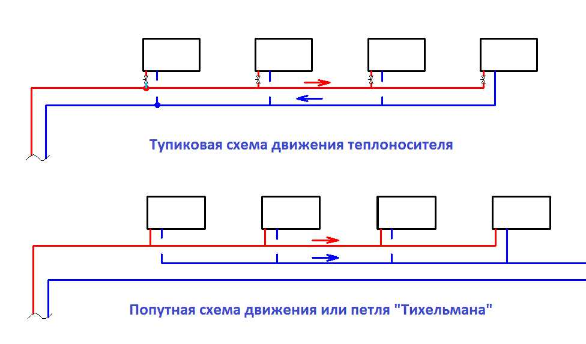
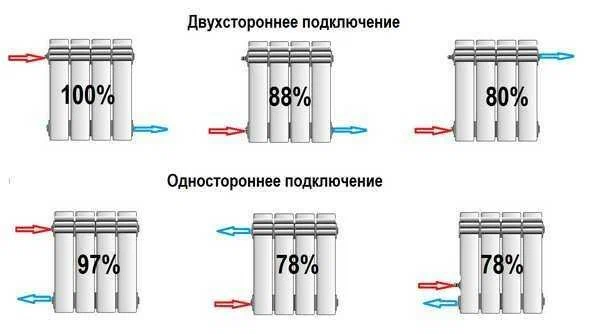

# Отопление

- [Схема помещения](#схема-помещения)
- [Схема отопления](#схема-отопления)
- [Замена котла](#замена-котла)
- [Удаление старой системы](#удаление-старой)
- [Установка новой системы](#установка-новой)
- [Установка котла](#установка-котла)
- [Запуск системы](#запуск-системы)
- [Инструменты](#инструменты)

## Схема помещения

[Remplanner](https://remplanner.ru/planner/)

## Схема отопления

### Двухтрубная тупиковая

 
#### Балансировка

- первый радиатор закрывается для создания сопротивления
- последний радиатор открывается на максимум
- вынести кухонный радиатор в отдельный контур

### Диаметр трубы

- основная труба - **25**
- подвод к радиатору - **20**

### Котел

TODO

встроенный насос  
производительность насоса

- расстояние
- литров в минуту
  встроенный расширительный бак
  мощность (~18кВт)
- мощность на квадратный метр
- мощность на точку горячей воды

электроснабжение

- стабилизатор напряжения
- блок бесперебойного питания
- подключение к розетке

дымоход

- 30 см от стены (длинный не рекомендуют)
- под углом к земле (конденсат стекает на улицу)
- пена обычная (не огнеупорная)

### Радиаторы

TODO

кол-во секций для комнат
кол-во секций для зала  
высота (можно взять меньшей высоты, но с больштм кол-вом секций)  
материал (алюминий, биметалл)

#### Подключение

#### Комплектующие

TODO

вентили  
балансирующая арматура  
заглушки  
кран Маевского

### Трубы

TODO
#### Армированные стекловолокном
  - большой коэффициент линейного удлинения (изгибаются при нагреве)
  - нет кислородного защитного слоя

#### Армированные аллюминием
  - TODO

## Замена котла

TODO

документы для заявки  
изменение схемы подачи газа  
заявка в горгаз

### Перенос газовой трубы

1. По месту жительства находите газообслуживающую организацию – нужно подать заявление о переносе газовой трубы. По этому заявлению на дом приходит мастер, который делает осмотр места, определяет возможность осуществления переноса, делает расчеты и составляет смету.
1. После того, как работа будет оплачена, назначается день проведения переноса газовой трубы. Не забудьте только заблаговременно проверить наличие сертификатов/разрешений у организации на проведение подобных работ.
1. Приехавшие в назначенный день специалисты должны предъявить свои документы, а заказчик должен проверить даты их последней переаттестации.
1. После окончания работ все изменения должны быть внесены в газовый паспорт.

### Замена котла

1. Идем в местную газораспределительную организацию (Горгаз, Облгаз, Районгаз и т.д.), оформляем там и сдаем **заявление на установку** газового котла. Необходимые документы – паспорт и любые свидетельства о вашем праве собственности на дом и придомовую территорию. После подачи заявления котел поставят в очередь на отключение, а через время выдадут **технические условия** (ТУ) – это и есть разрешение. Пока ТУ не выдали, можно заняться демонтажем котла (самостоятельно или с привлечением специалистов).
1. В органах пожарного надзора или ЖКХ узнаем контакты местной организации, занимающейся проверкой дымоходов (или вентиляционных каналов, если это квартира многоквартирного дома). После осмотра специалисты выдадут заключение о надлежащем состоянии дымохода (или вентиляции), в противном случае дадут перечень необходимых изменений.
1. Когда ТУ уже на руках, заказываем проект в том же «Горгазе» или любом проектном бюро, имеющим право на проведение таких работ. Для составления проекта потребуются данные о модели газового котла и счетчика.
1. С готовым проектом, ТУ, заключением о состоянии дымохода (или вентиляции) снова направляемся в местную газораспределительную организацию, где отдаем на согласование проект, заключаем с газовиками договор на обслуживание котла. Теперь можно самостоятельно или с привлечением специалистов (тех же местных газовиков) установить котел.
1. Финальным шагом является обращение к газовикам для приема монтажных работ, подключения котла к газовой магистрали, произведение первого пуска и наладки. По завершению всех работ в паспорте котла должны поставить соответствующую отметку (без нее гарантия на котлоагрегат распространяться не будет).

> ⚠️ **Оформление замены котлоагрегата занимает от 1,5 до 3 месяцев**

### Документы

- план дома (ксерокопия)
- сведения о гос регистрации прав собственности (ксерокопия)
- паспорт собственника
- паспорт на котел
- договор на обслуживание
- абонентская книжка

### Выдаваемые документы

- акт на дымоход
- акт на установку котла
- акт пуска котла
- отметка в паспорте котла (для гарантии)
- изменение в документацию
- изменение в абонентскую книжку
- изменение в договор на техническое обслуживание

## Удаление старой системы

### Cрез труб

- болгарка
  - огнеупорный экран
  - одежда
  - очки
- сабельная пила

### Вынос срезанных труб

- Ваня
- Паша

### Вывоз металлолома

- [ ] узнать организации

## Установка новой системы

### Установка радиаторов

TODO

### Прокладка труб

TODO

### Перекладка трубы горячей воды в ванну

TODO

## Установка котла

TODO

### Наполение системы

TODO

## Запуск системы

Запуск производят газовики

### Подготовка котла

- провернуть насос
  - снять корпус
  - открутить заглушку насоса
  - провернуть отверткой вал
- открыть воздухоспускатель
- заполнить систему
- проверить подключение вилки (фаза и ноль)

### Подготовка системыы

- заполнить теплоносителем
- спустить воздух

### Балансировка

TODO

## Инструменты

- пирометр
- лазерный нивелир
- резак для пластиковых труб
- паяльник для труб
- сабельная пила
  - полотно по металлу для сабельной пилы
- ступенчатый ключ для американок (внутренний ключ)
- гель анаэробный уплотнитель резьбы сантехмастер (синий)

# Полы

## Утепление пола

[Инструкция](https://www.youtube.com/watch?v=szXGiVsl2cE&ab_channel=FORUMHOUSE)

- выровнять полы (не более 10мм)
- экструзионный пенополистерол (50мм)
  - укладывается со смещением (1/2 длины)
- пароизоляция
- распределительный слой
  - гипсоволоконные плиты (не гипсокартон)
    - или фанера
    - или стекломагниевые листы
  - укладывается со смещением
  - укладывается 2 слоя для прочности
    - второй слой крепится саморезами
- подложка под ламинат
  - со смещением
- ламинат
